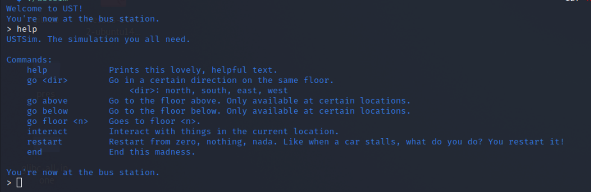

# Writeup

USTSim is a reverse-engineering CTF challenge I designed for the HKUST Firebird 2023 Internal CTF. This writeup won’t be very technical, but aims to guide you to the flag. Regardless, I encourage the reader to try the challenge before reading.

The challenge has been uploaded to [GitHub](https://github.com/TrebledJ/USTSim/tree/main/chal).

## Challenge Description

> Want to visit our nice campus while in quarantine? Want to go treasure hunting in UST during the breezy winter? Look no further! Introducing USTSim -- the brand new UST simulator with absolutely **NO** surprises!
> 
> You can find the jackpot above the firebird, but a little detour shouldn't hurt.

Flag format is `firebird{...}`.

## Recon

### Walking into Campus

First step? Get an intuition of what the binary does. Run it! The program seems to be a text-based adventure based in the HKUST campus. Most commands are listed by entering `help`.



From a preliminary exploaration, we may notice…

- The map has bounds. How large? The first floor has dimensions 20x11.
- We can go up/down floors, but this doesn’t work on just any tile—only on escalators/stairs.
- And more things!

### Prying Open the Binary

Next step? Analysis!


Loading the binary into a decompiler (e.g. Ghidra), some observations we might make are…

- `main()` starts by calling `M::l()` and `P::l()`.
    - The `M::l()` function run at the start reads data from…
        
        …`M::comp::F` (an array) and writes to `M::F`. From the disassembly, . Ditto for `P::l()`.
        
    - If we dive further and check cross-references of `M::F`, we see that…
        
        …`M::F` is accessed by the `M::g()` function, which in turn is called three times in `Game::Game()`[^constructor] and passed to `GameMap::GameMap()`. What does this suggest about the role of `M::F`, `P::F`, `M::l()`, and `P::l()`?
        
- Game logic is contained in the `Game` class.
- Logic for commands are split into different classes, in [Command Pattern](https://refactoring.guru/design-patterns/command) fashion.
- One of the critical points is `0x4125ed` (`Game::finish + 0x1b9`), an if-statement which decides if we’ve found the flag or not. If the condition is true, we’ve found the flag. If not, we haven’t found it. More on `Game::finish()` later.

[^constructor]: `Game::Game` is the constructor of `Game`. The destructor? `Game::~Game`. This is a special C++ convention. If you see the class name repeated twice, then know that it’s the constructor/destructor.

### Where’s the map?

We can reverse-engineer the map in two ways: statically or dynamically. Going dynamic is easier here. We simply fire up GDB, set a breakpoint after `P::l()`, and print the strings at `M::F`. It turns out the decoded characters are ASCII-encoded, so we can simply use the `x/s` GDB command to print strings.

```python
# Break after `P::l()`.
break * main+22

# Configure GDB to print without aggregating repeated characters.
set print repeats 0

# Print a string at 0x42ca40.
x/s 0x42ca40
```

In Ghidra, we know `M::F` goes from 0x42ca40 to 0x42ccd7 (663 chars). So we print strings until, corresponding to `M::F[0]`, `M::F[1]`, `M::F[2]`.

```python
# M::F[0]
x/s 0x42ca40
########################################GGG#################GGG.||.T###########*GGG..S.EESS.........GGG....EESS....b....mcccccccccccc.b.....mcccceecccccc.bbb...mcccccccccccc..b....|cccccccccccc.......LLLLLLLL...........B
# M::F[1]
x/s 0x42cb1d
CCCCHHH......AAAAAAACCCC##R......AAAAAAACCCC##R.................||T......CTCTCCC.....s.eess..CCCCCCC#######eess##########                   #                   #                   #                   LLLLLLL#############
# M::F[2]
x/s 0x42cbfa
CCCCC.CC.......CCCCCCCCCC....#####........CCC.||T#####.CCCCCCC.............CCCCCCCCCCCCCCCCCCCCCCCCCCC#                   #                   #                   #                   ####################
```

```python
# P::F[0]
x/s 0x42c7a0
..........X.................X.XX.....X.........X......XXX......XXXXXXXXXX.X...X...............X.X...XXXXXXXX.......X...XX............XX.XX..X.....XXXXXXXXXXXXXXX.....X....X...X...XX.....X...XX...X...XXXXXXXX........XXXXX
# P::F[1]
x/s 0x42c87d
....XXXXXXXXXXX.........X......XXX.XXX....XXX.....X...X...X.....XX.....X.....X.......XXX.X..XX.XX.....X....X......X.......X....X........XXXX..X....X..X.....X..X.......X....X......XXXXXXXXXXXXXXXXXXXXX..................XX
# P::F[2]
x/s 0x42c95a
.....XXX.............XXX...XXXXXX....X.........X................XXXXXXXXXXXXX......X.XX.X......XXX......XX.X........X.........XX.......XX.....XXX.X.........X...XXX.XXX...XXXX......X.....XXXXX......X..X.......X...........
```

For convenience, we’ll call these two sets the M-map and P-map.

So what are these `::F` used for?

Time to dig into cross-references (xrefs). Ghidra provides xrefs in the disassembly listing, next to the function name.

From `M::F`, notice `M::g(n)`, which selects which `M::F` to use, for `n = 0, 1, 2`.
This is only used in `Game::Game`, at `LAB_004170ca`. Here, they’re passed to the `GameMap` constructor. We can deduce that `M::F` is the game map, but what are the dimensions? 

The contents of `F` are passed to a vector member of `GameMap`. Let’s look at other `GameMap` methods to see how it’s used. After some noodling, we find `GameMap::unsafe_get(p1, p2, p3)`, which essentially access the vector with `vec[p3][p2 * 20 + p1]`. And since we know each `F` is 220 chars, we can factor this to deduce that each floor has 20x11 chars. And since there were three `M::F`s, that suggests there are three floors in the map.

We can also verify this dynamically in the game.[^dynverify] If we try to walk off the map, the game will warn us:

```cpp
Why are you trying to walk off the map? There's a flag to be found!
```

It turns out each floor is completely accessible, all 20x11x3 chars. Walls? We can smash through them. Air? We can levitate. (But we can’t rocket up or down. Again, we can only go up/down floors at specific cells.) Nothing stops us except the invisible confines of the game.

[^dynverify]: Are your fingers tired trying to check if all tiles are accessible? Hmm… if only there was a way to automate this process… I’m sure strings from `strings ustsim` or Ghidra’s Defined Strings tool would prove handy…

Let’s reformat the floors to get a better view:^[How do we know this orientation is correct? Trial and error. There are only two possibilities: 20x11 or 11x20. We can walk along an edge and cross-reference with the map.]

```
M::F[0]
####################
####################
GGG#################
GGG.||.T###########*
GGG..S.EESS.........
GGG....EESS....b....
mcccccccccccc.b.....
mcccceecccccc.bbb...
mcccccccccccc..b....
|cccccccccccc.......
LLLLLLLL...........B <-- We are here.
                   ^

M::F[1]
CCCCHHH......AAAAAAA
CCCC##R......AAAAAAA
CCCC##R.............
....||T......CTCTCCC
.....s.eess..CCCCCCC
#######eess#########
#                   
#                   
#                   
#                   
LLLLLLL#############

M::F[2]
CCC.CCCCCCCCCCCCCCCC
CCC.CC.......CCCCCCC
CCC....#####........
CCC.||T#####.CCCCCCC
.............CCCCCCC
CCCCCCCCCCCCCCCCCCCC
#                   
#                   
#                   
#                   
####################
```

We kinda figured out what `M::F` is. It appears to be a 20x11x3 map. What does each tile do? 🤷‍♂️ Probably encodes the different locations. At least we know `B` = Bus Stop. We can write another script to discover what each cell is. But to save you some time, here are some of the more important locations:

- `b`: The sundial. The flag is said to be above it.
- `e`/`E`: Upwards/Downwards escalator
- `s`/`S`: Upwards/Downwards stairs
- `|`: Elevator
- `~~T`: Toilet. A very important place.~~

What about `P::F`? It has the same dimensions: 20x11x3. Perhaps it’s an annotation of the main map? Something to indicate a value for each tile? With `P::F`, notice how there are only two kinds of tiles: `.` and `X`. What does it mean though? Let’s step back into the `Game` class and take a look.

### Victory Conditions

Taking a closer look at `Game::finish()`, we may notice:

- There are three conditions for flag-checking to succeed:
    - The [djb2](https://theartincode.stanis.me/008-djb2/) hash of the flag concatenated with its length (`local88`) should be 0xe600b08912974f5e. That is, `local88 = [this+0x68] + size([this+0x68])`.
    - The length of the flag (`this+0x68`) is 60.
    - The value of the counter (`this+0x60`) is also 60.
- Now we’re interested in `this+0x68` and `this+0x60`—specifically, where are they modified?
    
    
    
    - `Game::start()`. When the game starts, the flag is cleared and the counter reset.
    
    
    
    - `Game::push_loot()`. When this function is called, a char is appended to the flag. And if the current location on the P-map is an X, the counter increments.

We now know the purpose of the M-map (locations) and the P-map (treasure). The P-map is pretty limited. For your reference, here is the P-map of the first floor:

```
P::F[0]
..........X.........
........X.XX.....X..
.......X......XXX...
...XXXXXXXXXX.X...X.
..............X.X...
XXXXXXXX.......X...X
X............XX.XX..
X.....XXXXXXXXXXXXXX
X.....X....X...X...X
X.....X...XX...X...X
XXXXXXX........XXXXX
```

Not too bad, right? Some parts are there to throw you off, but I’m sure you’ll manage.

At this point, all that’s left is to reverse-engineer the path to the treasure. Again, we can do this statically or dynamically. Statically: we dig further into `Game::push_loot()` and figure out how `loot::get()`, `char_puker::get()`, and so on works. Dynamically: we can brute-force solutions by generating (with [DFS](https://en.wikipedia.org/wiki/Depth-first_search)) all paths of length 60, and check them on the sim (or via angr) to see if it is the correct path. In proper mentor fashion, I’ll leave this decision and step as an exercise for the reader.

## Flag
```
firebird{D1d_y0u_b0rroW_a_80ok_on_revers1ng_in_th3_libr42y?}
```